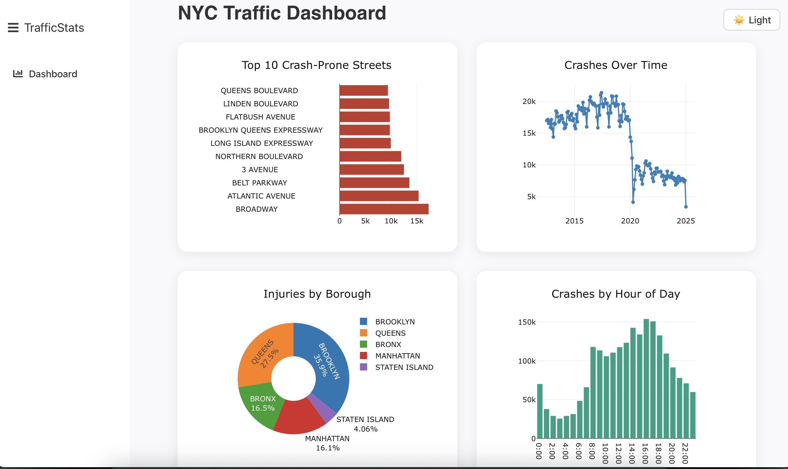
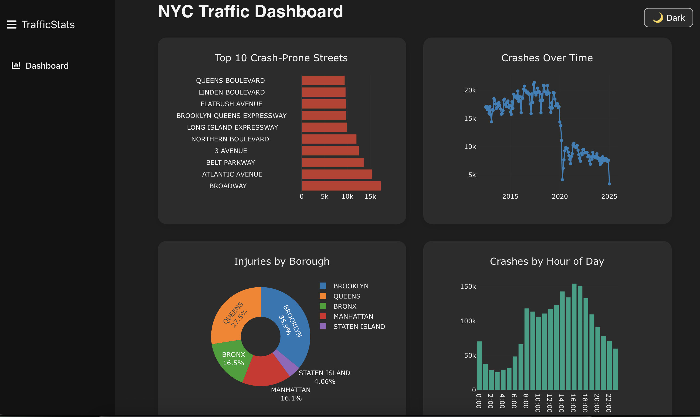

# NYC Traffic Collision Analysis Dashboard

This project provides a comprehensive analysis of motor vehicle collisions in New York City. It features a data-driven dashboard that visualizes crash data, identifies high-risk areas, and uncovers key trends to enhance road safety. The project is built with a React frontend and a Flask backend, and the data analysis is performed using Pandas.

## Features

- **Interactive Dashboard**: A user-friendly interface to explore NYC crash data.
- **Data Visualization**: Charts and graphs to visualize crash trends, and contributing factors.
- **Data Analysis**: In-depth analysis of the NYC OpenData Motor Vehicle Collisions dataset.
- **API**: A Flask-based API to serve the processed data to the frontend.

## Live Demo

*You can view the live dashboard here: [Dashboard live demo](https://traffic-analyze.onrender.com).*

## Screenshot





## Technologies Used

- **Frontend**: React, Vite, Plotly.js, Axios
- **Backend**: Flask, Pandas
- **Data Source**: [NYC OpenData Motor Vehicle Collisions - Crashes](https://data.cityofnewyork.us/Public-Safety/Motor-Vehicle-Collisions-Crashes/h9gi-nx95)

## Data Analysis

The data analysis for this project was performed in a Jupyter Notebook, which can be found in the root directory of the project. The notebook provides a detailed walkthrough of the data cleaning, preprocessing, and analysis steps.

### Key Insights

- **Most Dangerous Streets**: The analysis identified the top 10 most crash-prone streets in NYC.
- **Crash Trends**: The project reveals trends in crashes over time, including seasonal and daily patterns.
- **Contributing Factors**: The analysis uncovers the most common contributing factors to vehicle collisions.
- **Vehicle Types**: The project identifies the vehicle types most frequently involved in crashes.


### Installation

1. **Clone the repository:**
   ```bash
   git clone https://github.com/your-username/traffic_analyze.git
   ```
2. **Install frontend dependencies:**
   ```bash
   cd frontend
   npm install
   ```
3. **Install backend dependencies:**
   ```bash
   cd ../backend
   pip install -r requirements.txt
   ```

### Running the Application

1. **Start the backend server:**
   ```bash
   cd backend
   python app.py
   ```
2. **Start the frontend development server:**
   ```bash
   cd ../frontend
   npm run dev
   ```
